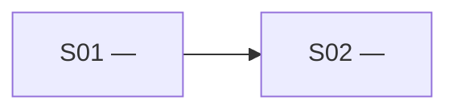

# Slice Map

An implementation plan can be complete and still be unusable. `slice-map` lowers
its resolution into a **critical path**: a durable map of narrow vertical slices,
the real gates between them, and the next slice a human can understand and take.

This skill plans implementation. Its output is the map; execution and ticket
publication are separate handoffs.

Its map and frontier follow Matt Pocock's `/wayfinder`; its tracer-bullet slices
follow `/to-tickets`. This skill joins those ideas at a different seam:
understanding and sequencing an implementation plan before ticket publication.

## Boundaries

- An unresolved product or architecture question belongs in `/wayfinder`.
- Decisions already made but not consolidated into a specification belong in
  `/to-spec`.
- An implementation-ready plan belongs here.
- An approved slice map can be published as executable tickets with `/to-tickets`.

These are explicit handoffs. Stop and tell the user which skill to invoke when the
input sits outside this skill's boundary.

## Vocabulary

- **Destination** — the observable state reached when the source plan is complete.
- **Vertical slice** — one narrow, independently verifiable behaviour cutting
  through every layer it needs, not every layer the system has.
- **Prerequisite** — minimal enabling work that passes the prerequisite test below.
- **Gate** — a concrete fact that prevents a dependent slice from starting or
  landing green.
- **Frontier** — every `Open` slice whose gates are cleared.
- **Critical path** — the longest unfinished dependency chain. Use longest total
  duration only when every unfinished slice has a trustworthy estimate; otherwise
  use node count and label it unestimated. Include only `Open` or `In progress`
  slices, require a direct edge between consecutive ids, and break ties by the
  leading slice's greater transitive unlock then its lowest stable id.

Call work a *slice*, *prerequisite*, or *gate*. A backend phase, frontend phase, or
testing phase is a horizontal layer, not a slice.

## Prerequisite test

Infrastructure belongs inside its first consuming slice by default. Make it a
separate prerequisite only when all three statements are true:

1. It either gates at least two slices, or is external access, a migration, or a
   wide refactor that must land separately to keep its consumer green.
2. It cannot sensibly live in any consuming slice.
3. It has an independently verifiable outcome.

Keep every prerequisite to the minimum that clears its gates.

## Recommendation rule

Recommend exactly one takeable slice in this order:

1. an `In progress` slice, preferring one on the critical path;
2. a prerequisite that gates every remaining route;
3. the frontier slice with the greatest transitive unlock, counted as unfinished
   descendants made reachable;
4. the slice that retires the earliest integration risk;
5. the smallest independently useful outcome;
6. the lowest stable slice id.

Each lower rule breaks ties left by the rules above it.


## Branch selector

- No map plus an implementation plan, issue, document, or current conversation →
  **Chart**. With no argument or plan in context, ask for the plan.
- An existing approved file matching the map contract plus a request for what to
  do next → **Navigate**.
- An existing draft map, or any existing map plus changed facts, scope, or
  sequencing → **Revise**.
- A genuinely ambiguous request → ask whether to chart, navigate, or revise, in
  one line.

## Map contract

The canonical artifact lives at `.scratch/<effort-slug>/slice-map.md`. Its slice
index is the single source of truth; the Mermaid graph is a derived view and must
be regenerated whenever an edge or status changes.

````markdown
# <Effort> — Slice map

**Map status:** Draft | Approved

## Destination

<Observable completion state, in one or two lines.>

## Source and constraints

- <Source plan, issue, document, or conversation>
- <Constraint that changes slicing or order>

## Critical path

<Ordered unfinished slice ids, why this chain controls progress, and whether the
method is estimated duration or unestimated node count. Include the winning
tie-break.>

## Dependency map



## Slice index

| ID | Slice | Kind | Delivers | Verification | Estimate | Blocked by | Gate | Status |
|---|---|---|---|---|---|---|---|---|
| S01 | <name> | Slice | <observable outcome> | <independent signal> | — | None | None | Open |

Use source-backed duration estimates; enter `—` when none are trustworthy.

Each **Gate** cell keys one reason to each blocker:
`S01: <concrete fact>; S02: <concrete fact>`.

Statuses: `Open`, `In progress`, `Done`. Only `Open` slices enter the frontier;
`In progress` is current work and `Done` clears dependent gates. Navigation
continues an `In progress` slice before recommending new frontier work.

Kinds: `Slice`, `Prerequisite`.

## Coverage audit

| Source item | Class | Accounted for by |
|---|---|---|
| <item from source> | Behaviour / Constraint / Validation | <owning slice, affected slices, or map-wide rule> |

## Frontier

- **Ready:** <all open slice ids whose blockers are Done>
- **Recommended next:** <exactly one in-progress or ready slice>
- **Why:** <gate-clearing leverage, risk retired, then smallest useful outcome>

## Revision history

- <YYYY-MM-DD> — <what changed and why>
````

The coverage audit may be detailed; keep it below the low-resolution graph and
slice index so the map remains skimmable.

## Run a branch

Load the one reference selected above, read it completely, then execute it:

- **Chart** — `references/chart.md`
- **Navigate** — `references/navigate.md`
- **Revise** — `references/revise.md`

**Done when:** the selected branch reaches its final completion criterion.

## Handoff

When the user wants tracker tickets, point them to `/to-tickets` with the approved
map path and instruct it to materialize the approved boundaries and gates unchanged.
A proposed structural change returns to **Revise** before publication. The map
remains the planning artifact; the tickets become the execution artifacts.
