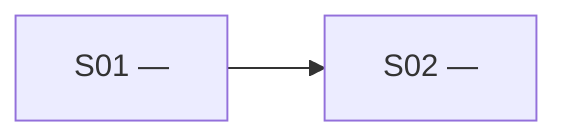

# Throughline

An implementation plan can be complete and still be unusable. A **throughline** lowers its
resolution into a critical path: narrow vertical slices, the real gates between them, and
the next slice a human can understand and take.

Its route and frontier follow Matt Pocock's `/wayfinder`; its tracer-bullet slices follow
`/to-tickets`, and behind that Hunt and Thomas's *The Pragmatic Programmer*.

## Boundaries

- An unresolved product or architecture question belongs in `/wayfinder`.
- Decisions already made but not consolidated into a specification belong in `/to-spec`.
- An implementation-ready plan belongs here.
- An approved throughline can be published as executable tickets with `/to-tickets`.

Stop and name the owning skill when the input sits outside this boundary. Those three are
Matt Pocock's; before pointing the user at one, check `~/.claude/skills/<name>/`,
`~/.agents/skills/<name>/`, and the active profile's `skills/<name>/`, and give the install
command when it is absent:

```
npx skills add mattpocock/skills --skill=<name>
```

## Vocabulary

- **Destination** — the observable state reached when the source plan is complete.
- **Vertical slice** — one narrow, independently verifiable behaviour cutting through every
  layer it needs, not every layer the system has.
- **Prerequisite** — minimal enabling work that passes the prerequisite test below.
- **Gate** — a concrete fact that prevents a dependent slice from starting or landing green.
- **Transitive unlock** — the unfinished descendants a slice makes reachable.
- **Takeable** — a slice that is `In progress`, or `Open` with every blocker `Done`.
- **Critical path** — the longest unfinished dependency chain. Use longest total duration
  only when every unfinished slice has a trustworthy estimate; otherwise use node count and
  label it unestimated. Include only `Open` or `In progress` slices, require a direct edge
  between consecutive ids, and break ties by the leading slice's greater transitive unlock
  then its lowest stable id.

Call work a *slice*, *prerequisite*, or *gate*. A backend phase, frontend phase, or testing
phase is a horizontal layer, not a slice.

## Prerequisite test

Infrastructure belongs inside its first consuming slice by default. Make it a separate
prerequisite only when all three statements are true:

1. It either gates at least two slices, or is external access, a migration, or a wide
   refactor that must land separately to keep its consumer green.
2. It cannot sensibly live in any consuming slice.
3. It has an independently verifiable outcome.

Keep every prerequisite to the minimum that clears its gates.

## Frontier and recommendation

Statuses are `Open`, `In progress`, and `Done`. `In progress` is current work; `Done` clears
dependent gates. The **frontier** is every `Open` slice whose blockers are all `Done`.

Recommend exactly one takeable slice by this ladder:

1. an `In progress` slice, preferring one on the critical path;
2. a prerequisite that gates every remaining route;
3. the frontier slice with the greatest transitive unlock;
4. the slice that retires the earliest integration risk;
5. the smallest independently useful outcome;
6. the lowest stable slice id.

Each lower rule breaks ties left by the rules above it.

## Branch selector

- No throughline plus an implementation plan, issue, document, or current conversation →
  **Chart**. With no argument or plan in context, ask for the plan.
- An existing approved file matching the contract plus a request for what to do next →
  **Navigate**.
- An existing draft, or any existing throughline plus changed facts, scope, or sequencing →
  **Revise**.
- A genuinely ambiguous request → ask whether to chart, navigate, or revise, in one line.

## Throughline contract

The canonical artifact defaults to `./throughline-<effort-slug>.md`; confirm the destination
with the user before writing. Its slice index is the single source of truth; every other
section is a derived view, regenerated whenever an edge or status changes.

````markdown
# <Effort> — Throughline

**Status:** Draft | Approved

## Destination

<Observable completion state, in one or two lines.>

## Source and constraints

- <Source plan, issue, document, or conversation>
- <Constraint that changes slicing or order>

## Critical path

<Ordered unfinished slice ids, why this chain controls progress, and whether the method is
estimated duration or unestimated node count. Include the winning tie-break.>

## Dependency graph



## Slice index

| ID | Slice | Kind | Delivers | Verification | Estimate | Blocked by | Gate | Status |
|---|---|---|---|---|---|---|---|---|
| S01 | <name> | Slice | <observable outcome> | <independent signal> | — | None | None | Open |

Use source-backed duration estimates; enter `—` when none are trustworthy.

Each **Gate** cell keys one reason to each blocker: `S01: <concrete fact>; S02: <concrete fact>`.

Kinds: `Slice`, `Prerequisite`.

## Coverage audit

| Source item | Class | Accounted for by |
|---|---|---|
| <item from source> | Behaviour / Constraint / Validation | <owning slice, affected slices, or a throughline-wide rule> |

## Frontier

- **Ready:** <every open slice id whose blockers are Done>
- **Recommended next:** <exactly one takeable slice>
- **Why:** <the ladder rule that selected it — gate cleared, risk retired, or useful outcome>

## Revision history

- <YYYY-MM-DD> — <what changed and why>
````

The coverage audit may be detailed; keep it below the dependency graph and slice index so
the throughline stays skimmable.

## Run a branch

Load the one reference selected above, read it completely, then execute it:

- **Chart** — `references/chart.md`
- **Navigate** — `references/navigate.md`
- **Revise** — `references/revise.md`

## Handoff

Publication with `/to-tickets` materializes the approved boundaries and gates unchanged; a
proposed structural change returns to **Revise** first. The throughline stays the planning
artifact; the tickets become the execution artifacts.

## Rejected framings

- *slice map* as the name — *slice* collides with Redux slices, array slices, and time
  slices, and *map* undersells the single recommendation this skill owes the user.
- *phase* as a unit of work — it names a horizontal layer, which the vocabulary rules out.
